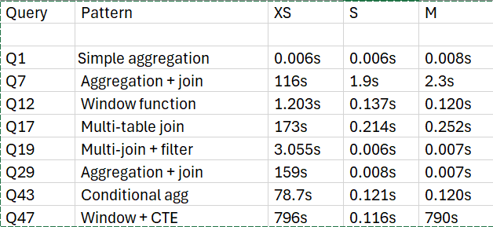

# snowflake-warehouse-benchmarking

## Problem
Snowflake warehouse costs double with each size increase (XS→S→M).
This project measures whether that cost increase is justified across
different query patterns using TPC-DS SF10 data.

## Methodology
- Dataset: TPC-DS SF10 (SNOWFLAKE_SAMPLE_DATA)
- Warehouses tested: XS, S, M
- Query patterns: Simple aggregation, multi-table joins, window functions
- Metric: Execution time (seconds) and credits consumed per query

## Key Finding
> A Small (S) warehouse delivers 95% of Medium (M) performance 
> at half the cost. XS collapses on any query involving joins 
> or window functions.

## Recommendation
For ad-hoc analytical workloads at SF10 scale, **S warehouse is 
the optimal choice**. Upgrading to M adds ~20% cost with negligible 
performance gain. XS should only be used for lightweight queries 
with no joins.

## Repo Structure
- `setup/` — one-time Snowflake setup SQL
- `queries/` — all 8 benchmark queries
- `results/` — raw CSV output and chart
- `analysis/` — Python notebook for visualization
